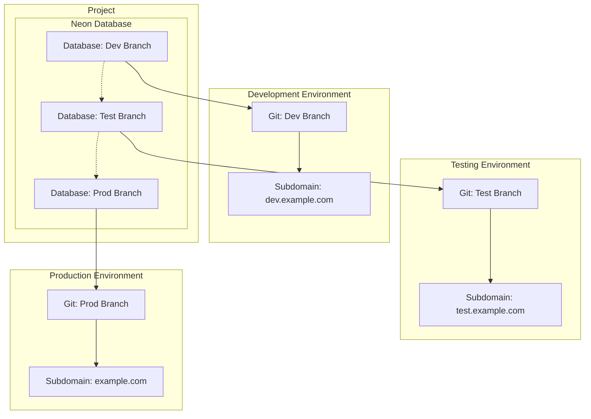

# Astro + Lucia Auth + Neon Serverless Postgres with Prisma + shadcn/ui

This starter uses the [Astro StarterKit](https://astro.build/) set up with [Lucia Auth](https://lucia-auth.com/) (username and password), Prisma with [Neon Postgres](https://neon.tech) as the database, and Tailwind with [shadcn/ui](https://ui.shadcn.com/). The database can be used for queries and data fetching outside of the Auth mechanisms too.


The [serverless driver](https://github.com/neondatabase/serverless) is used for Neon Postgres. This is integrated with Prisma via the `previewFeatures = ["driverAdapters"]` in the `schema.prisma` file. The Prisma Client setup is located in `./lib/prisma.ts`.

```ts
import { Pool, neonConfig } from "@neondatabase/serverless";
import { PrismaNeon } from "@prisma/adapter-neon";
import { PrismaClient } from "@prisma/client";
import dotenv from "dotenv";
import ws from "ws";

dotenv.config();
neonConfig.webSocketConstructor = ws;
const connectionString = `${process.env.DATABASE_URL}`;

const pool = new Pool({ connectionString });
const adapter = new PrismaNeon(pool);

let sql = (global as any).sql || new PrismaClient({ adapter });

if (process.env.NODE_ENV === "development") (global as any).sql = sql;

export default sql;
```

<small>Reference: [Connect from Prisma to Neon](https://neon.tech/docs/guides/prisma)</small>

## Project Structure

Inside of your Astro project, you'll see the following folders and files:

```diff
/
+ ├── lib/
+ │   ├── lucia.ts
+ │   └── prisma.ts
+ ├── prisma/
+ │   └── schema.prisma
  ├── public/
  │   └── favicon.svg
  ├── src/
  │   ├── components/
  │   │   └── Card.astro
  │   ├── layouts/
  │   │   └── Layout.astro
  │   └── pages/
  │       ├── api/
+ │       │   ├── logout.ts
+ │       │   └── hello-protected.ts
+ │       ├── middleware.ts
+ │       ├── login.astro
+ │       ├── signup.astro
  │       └── index.astro
  └── package.json
```

### Protected API Route

The `/api/hello-protected` API route is an example of restricting API access with the Auth session.

## Getting Started

- Sign up to [Neon](https://neon.tech/).
- Follow our [Create your first project](https://neon.tech/docs/get-started-with-neon/setting-up-a-project) guide.

### Development environment

1. Install the dependencies:

```
pnpm install
```

2. Add your Neon Postgres database URL as an Environment Variable in `.env`

```
DATABASE_URL=""
```

3. Generate the Prisma Client

```
npx prisma generate
```

4. Push the schema to your database. Now, the table structure is reflected in your Neon database. This is a minimal schema used by Lucia.

```
npx prisma db push
```

5. Run the server

```
pnpm dev
```

## A Database branch for each environment

To isolate data sources between environments, create a different [database branch](https://neon.tech/docs/introduction/branching) for each environment.

Create a corresponding environment variable dotenv file (`.env.development` or `.env.production`) with the branch connection URL.

The Neon Project has a database (1 or more) and each branch is derived from that database branch. Each one of the branches maps to the development environment for the app. Or, new database changes can be tested on lower environment schemas before applying the stable environments (i.e. prod).



## Deploy

- This is configured to deploy on Vercel in `astro.config.mjs`.

Adjust the build command so that the Prisma Client is regenerated during CI/CD.

```
prisma generate && astro build
```

- Additional [Astro Deployment Guides](https://docs.astro.build/en/guides/deploy/)
